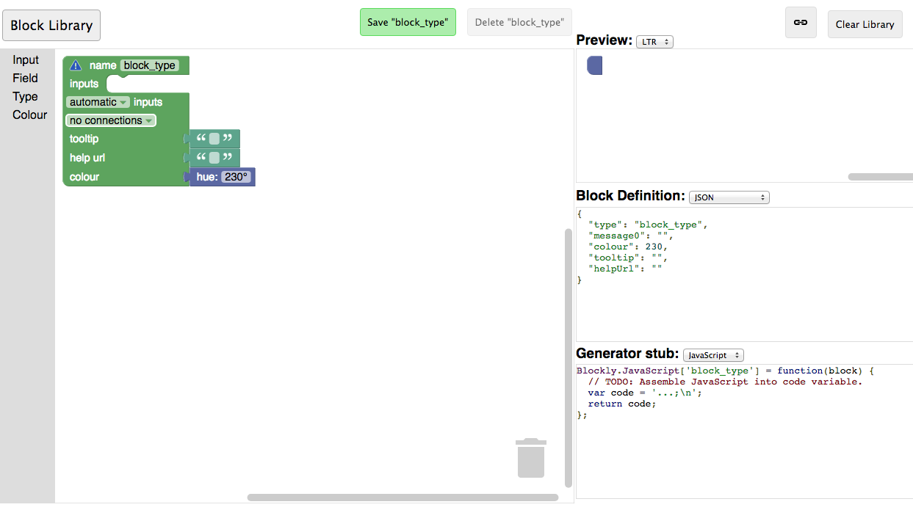
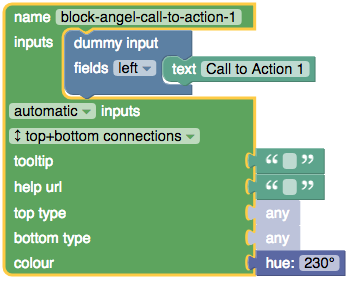
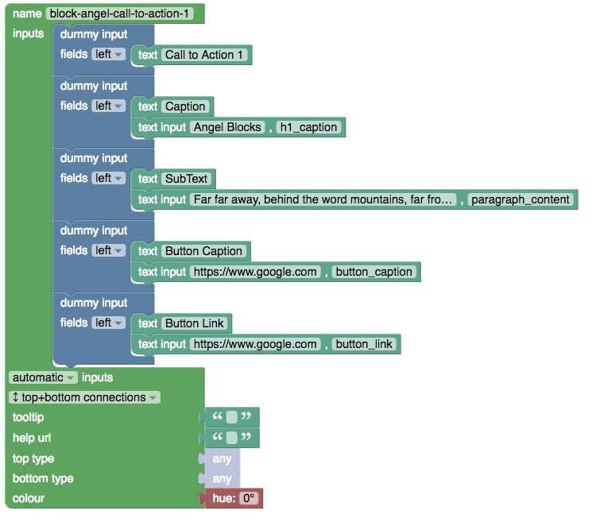

# blockAnatomy


Blocks are basically nothing else than js code. There are two basic functions. The first one is the function that defines the parameters and the view in the UI. The second function generates the code to be used on the HTML page. The example of these two functions are shown below.


### Parametric Fields

Parametric fields are the most flexible part of the blocks. It let the user change the text, color, or the look of the block. For example, the button block has a caption parameter field so that the user can edit it from the UI. Please think about the other users that may want to change something in your block. Of course, the number of the parameter fields cannot be so much. We can not let the user change every part of the block. Please consider not to use parametric fields more than 3 or max 4. This may end with a very complicated, hard to use blocks. You can find in the below **How to develop a block for blockAngel** part for how to make a field parametric.


## How to develop a block for blockAngel

blockAngel can be useful tool unless having lots of reusable blocks. So we need your support for creating new blocks. Please think for others and develop a block that many people need it to use on their web page. Let's do it with an example. Suppose that we want to build a **call to action block**. We will follow the below steps:

### 1- Design a HTML page (keep it simple). 


This is the design that you want to make it blockAngel block. Here is the HTML code.

```html
<!DOCTYPE html>
<html lang="en">
<head>
    <meta charset="utf-8">
    <meta name="viewport" content="width=device-width, initial-scale=1, shrink-to-fit=no">
    <meta name="description" content="">
    <meta name="author" content="">
    <link rel="icon" href="">

    <title>Blockangel Theme Parts</title>

    <!-- Bootstrap core CSS -->
    <link rel="stylesheet" href="https://maxcdn.bootstrapcdn.com/bootstrap/4.0.0/css/bootstrap.min.css" integrity="sha384-Gn5384xqQ1aoWXA+058RXPxPg6fy4IWvTNh0E263XmFcJlSAwiGgFAW/dAiS6JXm" crossorigin="anonymous">
    <link rel="stylesheet" href="https://use.fontawesome.com/releases/v5.1.0/css/all.css" integrity="sha384-lKuwvrZot6UHsBSfcMvOkWwlCMgc0TaWr+30HWe3a4ltaBwTZhyTEggF5tJv8tbt" crossorigin="anonymous">

</head>


<body>


        
       
    <div class="content004">
        <div class="container-fluid content004_inner text-center">
            <div class="row align-middle">
                <div class="col-md-12 align-self-center">
                    <h1>Angel Blocks</h1>
                    <p class="text-h3">Far far away, behind the word mountains, far from the countries Vokalia and Consonantia, there live the blind texts.</p>
                    <p class="mt-4 mb-5"><a class="btn btn-danger" href="https://www.google.com">Button</a></p>
                </div>

                <div class="col-md-0 content004-right">

                </div>

            </div>
        </div>
    </div>
    
    
   
</body>
</html>

```

Open it in your browser and be sure that it is the final design. We will only take the div section over the &lt;/body&gt; tag.

### 2- Decide the parametric fields. 

The parts that you will give the flexibility to be changed from the UI. Give them a variable name.

**Parametric parts:**

- &lt;h1&gt;Angel Blocks&lt;/h1&gt; : h1_caption
- &lt;p class="text-h3"&gt; text &lt;/p&gt; : paragraph_content
- The button caption : button_caption
- Button link for call to action : button_link

### 3- Change the text you want to make parametric with the var name like this.

&lt;h1&gt;Angel Blocks&lt;/h1&gt; will be &lt;h1&gt;${h1_caption}&lt;/h1&gt;

and the overall code will be:

```html
        
    <div class="content004">
        <div class="container-fluid content004_inner text-center">
            <div class="row align-middle">
                <div class="col-md-12 align-self-center">
                    <h1>${h1_caption}</h1>
                    <p class="text-h3">${paragraph_content}</p>
                    <p class="mt-4 mb-5"><a class="btn btn-danger" href="${button_link}">${button_caption}</a></p>
                </div>

                <div class="col-md-0 content004-right">

                </div>

            </div>
        </div>
    </div>


```

### 4- Design your block with block factory

The block factory is a great tool designed by Google engineers. Now we will use this tool to design our block's user interface.
Before using block factory please watch [this video](https://www.youtube.com/watch?time_continue=2&v=s2_xaEvcVI0) on how to use it. It is just 13 minutes :) 

Now let's go to [Google Block Factory](https://blockly-demo.appspot.com/static/demos/blockfactory/index.html) and design our block UI

When you open the block factory you will start with a blank UI like the picture below:




Start with giving the block name. Please read the naming Convention section of this document before.
Let's give this block the name "block-angel-call-to-action-1". Write it at the top.
From the inputs section drag a dummy input and put it in the input section. Then from the fields section grap a text field and put it in the dummy input. Write "Call to Action 1" as the text. This will be the caption of our block.
From the no connection drop-down select top+botton connections. Now you have something like the below picture.



Now it is time to set the color of our block. Colors are used to visually group the blocks into categories. Blockly uses numbers between 0-360, defining the block's hue in the hue-saturation-value HSV color model. For our call to action category color is Hue 0. In the conventions section, you can find the colors for categories. If you do not find any title that fit your block you can set your own color.

Now we can define the parametric fields. Please add four more dummy inputs with one text field and one text input. These are caption, subText, button caption and button link. Give them appropriate names. I also add the default values same with the HTML template. See the below picture it is easy.



We all most done. We can copy the Block Definition in Javascript and the Generator stub. Please find them below.

```javascript

Blockly.Blocks['block_angel_call_to_action_1'] = {
  init: function() {
    this.appendDummyInput()
        .appendField("Call to Action 1");
    this.appendDummyInput()
        .appendField("Caption")
        .appendField(new Blockly.FieldTextInput("Angel Blocks"), "h1_caption");
    this.appendDummyInput()
        .appendField("SubText")
        .appendField(new Blockly.FieldTextInput("Far far away, behind the word mountains, far from the countries Vokalia and Consonantia, there live the blind texts."), "paragraph_content");
    this.appendDummyInput()
        .appendField("Button Caption")
        .appendField(new Blockly.FieldTextInput("Button"), "button_caption");
    this.appendDummyInput()
        .appendField("Button Link")
        .appendField(new Blockly.FieldTextInput("https://www.google.com"), "button_link");
    this.setPreviousStatement(true, null);
    this.setNextStatement(true, null);
    this.setColour(0);
 this.setTooltip("");
 this.setHelpUrl("");
  }
};

// I remove the text prefix

Blockly.JavaScript['block_angel_call_to_action_1'] = function(block) {
  var h1_caption = block.getFieldValue('h1_caption');
  var paragraph_content = block.getFieldValue('paragraph_content');
  var button_caption = block.getFieldValue('button_caption');
  var button_link = block.getFieldValue('button_link');
  // TODO: Assemble JavaScript into code variable.
  var code = '...;\n';
  return code;
};

```

The code block at the top is the function that defines the block in the UI. The second one is the generator. We need to modify the generator in order to generate HTML code from this block.

After the modification code generator will be like below.


```javascript

Blockly.JavaScript['block_angel_call_to_action_1'] = function(block) {
  var h1_caption = block.getFieldValue('h1_caption');
  var paragraph_content = block.getFieldValue('paragraph_content');
  var button_caption = block.getFieldValue('button_caption');
  var button_link = block.getFieldValue('button_link');


  var myCode = `    
    <div class="content004">
        <div class="container-fluid content004_inner text-center">
            <div class="row align-middle">
                <div class="col-md-12 align-self-center">
                    <h1>${h1_caption}</h1>
                    <p class="text-h3">${paragraph_content}</p>
                    <p class="mt-4 mb-5"><a class="btn btn-danger" href="${button_link}">${button_caption}</a></p>
                </div>

                <div class="col-md-0 content004-right">

                </div>

            </div>
        </div>
    </div>`;


           
  return myCode;

};


```

As you can see we get the parameters from UI and insert it into the HTML. We are returning this HTML code to the system in order to display.


## Naming Convention

### Block Names

block names must start with "block-angel-" prefix. ex: block-angel-simple-panel

### Block Javascript file name

Starts with lowercase ms prefix followed by the block name ex: msCall_to_action1.js

### Colors

Call to action: Hue 0