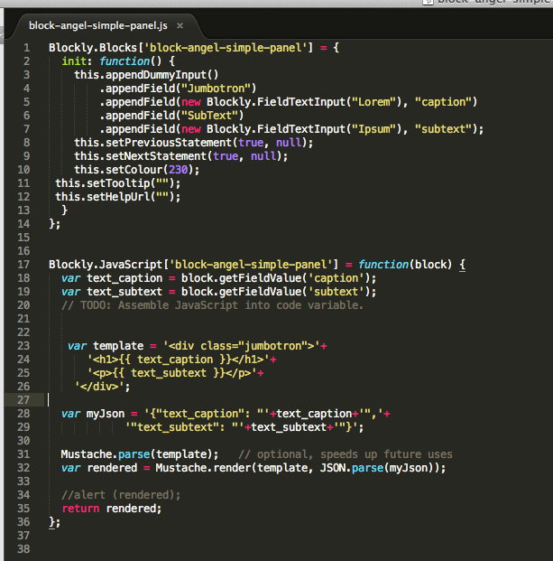

# blockAnatomy

Blocks are basically nothing else than js code. There are two basic functions. The first one is the function that definits the parameters and the view in the UI. The second function generates the code to be used on the HTML page. The example of these two functions is shown below.

## Naming Convention

### Block Names

block names must start with "block-angel-" prefix. ex: block-angel-simple-panel

### CSS Names

