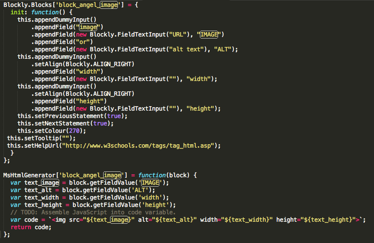

# blockAnatomy


Blocks are basically nothing else than js code. There are two basic functions. The first one is the function that defines the parameters and the view in the UI. The second function generates the code to be used on the HTML page. The example of these two functions is shown below.




### Parametric Fields

Parametric fields are the most flexible part of the blocks. It let the user change the text, color, or the look of the block. For example, the button block has a caption parameter field so that the user can edit it from the UI. Please think about the other users that may want to change something in your block. Of course, the number of the parameter fields cannot be so much. We can not let the user change every part of the block. Please consider not to use parametric fields more than 3 or max 4. This may end with a very complicated, hard to use blocks. You can find in the below **How to develop a block for blockAngel ** part for how to make a field parametric.


## How to develop a block for blockAngel

blockAngel can be useful tool unless having lots of reusable blocks. So we need your support for creating new blocks. Please think for others and develop a block that many people need it to use on their web page. Let's do it with an example. Suppose that we want to build a **call to action block**. We will follow the below steps:

##1- Design a HTML page with its CSS (and JS). 

We are here talking about one HTML page with inline CSS inside <style> tag. This is the design that you want to make it blockAngel block. Here is the HTML code.

```html
<!DOCTYPE html>
<html lang="en">
<head>
    <meta charset="utf-8">
    <meta name="viewport" content="width=device-width, initial-scale=1, shrink-to-fit=no">
    <meta name="description" content="">
    <meta name="author" content="">
    <link rel="icon" href="">

    <title>Blockangel Theme Parts</title>

    <!-- Bootstrap core CSS -->
    <link rel="stylesheet" href="https://maxcdn.bootstrapcdn.com/bootstrap/4.0.0/css/bootstrap.min.css" integrity="sha384-Gn5384xqQ1aoWXA+058RXPxPg6fy4IWvTNh0E263XmFcJlSAwiGgFAW/dAiS6JXm" crossorigin="anonymous">
    <link rel="stylesheet" href="https://use.fontawesome.com/releases/v5.1.0/css/all.css" integrity="sha384-lKuwvrZot6UHsBSfcMvOkWwlCMgc0TaWr+30HWe3a4ltaBwTZhyTEggF5tJv8tbt" crossorigin="anonymous">

</head>


<body>


    <style>
        @import url('https://fonts.googleapis.com/css?family=Open+Sans:300,400,600,800');

        body {
            font-family: 'Open Sans', sans-serif;
        }

        .btn a {
            color: white;
        }

        .calltoaction001 {
            min-height: 300px;
            border-style: solid;
            border-color: lightgray;
            border-width: 1px;
            margin: 20px;
            box-shadow: 2px 2px 2px rgba(5, 5, 5, 0.2);
        }

        .content004-right {
            min-height: 800px;
            background: orange;
        }

        .content004_inner {
            background: orange;
        }

    </style>


        
       
    <div class="content004">
        <div class="container-fluid content004_inner text-center">
            <div class="row align-middle">
                <div class="col-md-12 align-self-center">
                    <h1>Angel Blocks</h1>
                    <p class="text-h3">Far far away, behind the word mountains, far from the countries Vokalia and Consonantia, there live the blind texts.</p>
                    <p class="mt-4 mb-5"><a class="btn btn-danger" href="https://www.google.com">Button</a></p>
                </div>

                <div class="col-md-0 content004-right">

                </div>

            </div>
        </div>
    </div>
    
    
   
</body>
</html>

```

Open it in your browser and be sure that it is the final design. We will only take the style part and the below div section up to </body> tag.

##2- Decide the parametric fields. 

The parts that you will give the flexibility to be changed from the UI. Give them a variable name.

**Parametric parts:**

- <h1>Angel Blocks</h1> : h1_caption
- <p class="text-h3"> text </p> : paragraph_content
- The button caption : button_caption
- Button link for call to action : button_link

##3- Change the text you want to make parametric with the name inside two curly brackets.

<h1>Angel Blocks</h1> will be <h1>{{h1_caption}}</h1>

and the overall code will be:

```html

    <style>
        @import url('https://fonts.googleapis.com/css?family=Open+Sans:300,400,600,800');

        body {
            font-family: 'Open Sans', sans-serif;
        }

        .btn a {
            color: white;
        }

        .calltoaction001 {
            min-height: 300px;
            border-style: solid;
            border-color: lightgray;
            border-width: 1px;
            margin: 20px;
            box-shadow: 2px 2px 2px rgba(5, 5, 5, 0.2);
        }

        .content004-right {
            min-height: 800px;
            background: orange;
        }

        .content004_inner {
            background: orange;
        }

    </style>


        
       
    <div class="content004">
        <div class="container-fluid content004_inner text-center">
            <div class="row align-middle">
                <div class="col-md-12 align-self-center">
                    <h1>{{h1_caption}}</h1>
                    <p class="text-h3">{{paragraph_content}}</p>
                    <p class="mt-4 mb-5"><a class="btn btn-danger" href="{{button_link}}">{{button_caption}}</a></p>
                </div>

                <div class="col-md-0 content004-right">

                </div>

            </div>
        </div>
    </div>


```

##4- Design your block with block factory

The block factory is a great tool designed by Google engineers. Now we will use this tool to design our block's user interface.
Before using block factory please watch [this video](https://www.youtube.com/watch?time_continue=2&v=s2_xaEvcVI0) on how to use it. It is just 13 minutes :) 

Now let's go to [Google Block Factory](https://blockly-demo.appspot.com/static/demos/blockfactory/index.html) and design our block UI


## Naming Convention

### Block Names

block names must start with "block-angel-" prefix. ex: block-angel-simple-panel

### CSS Names